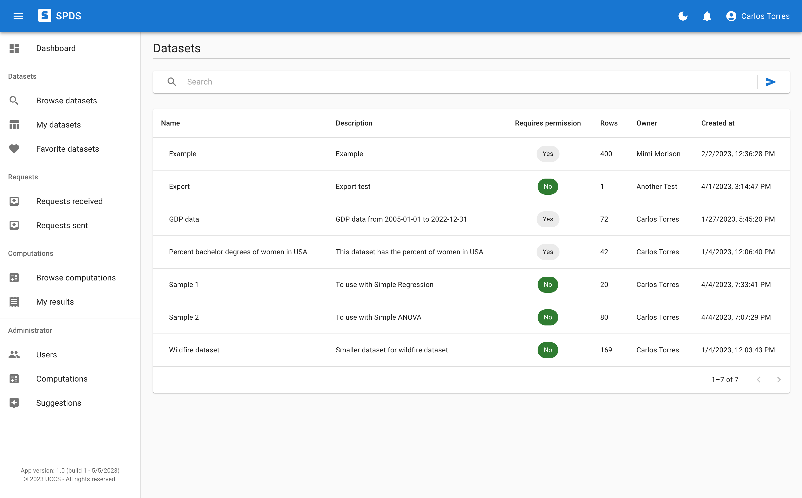
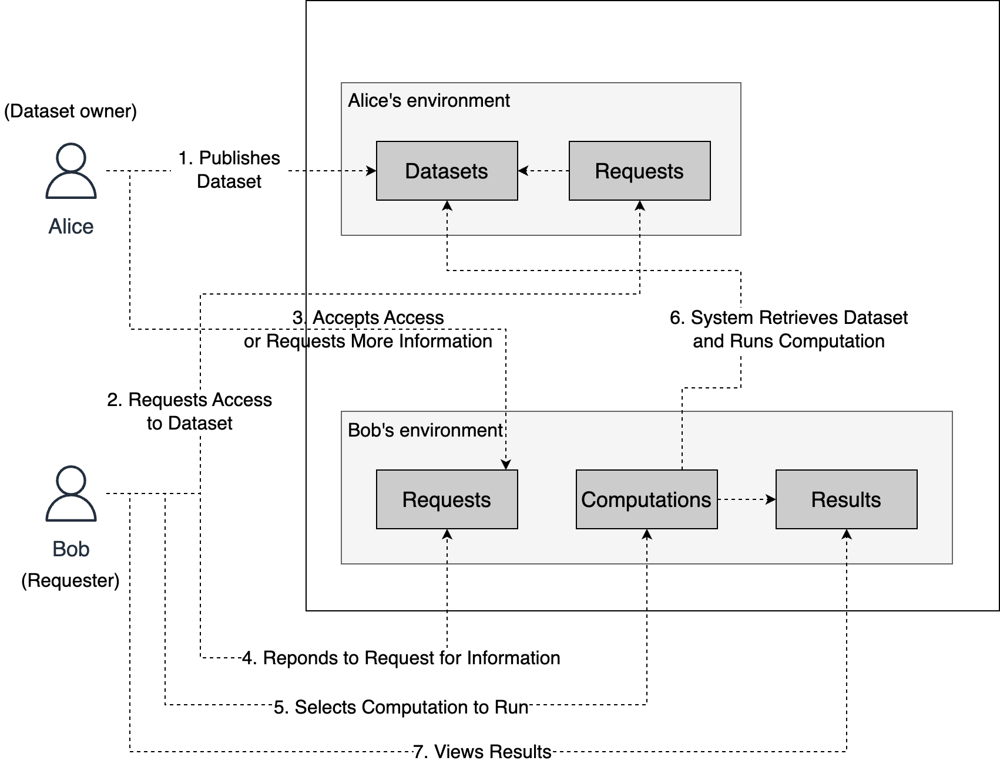
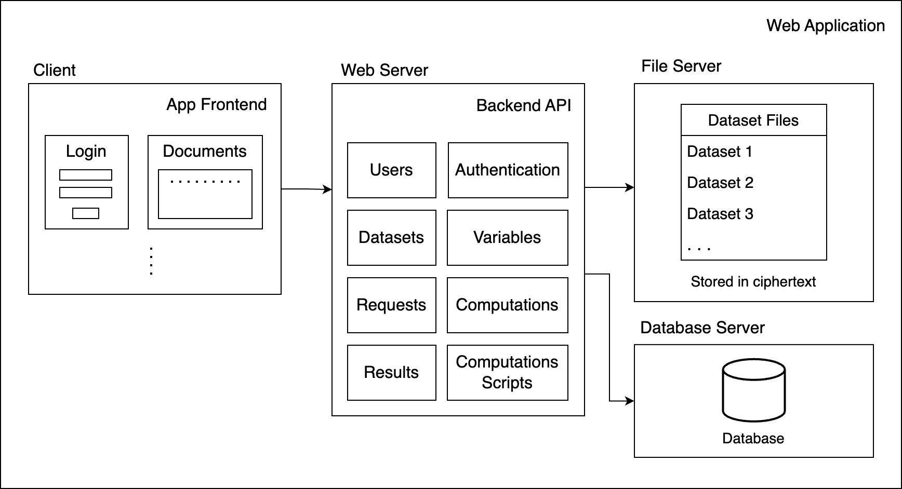
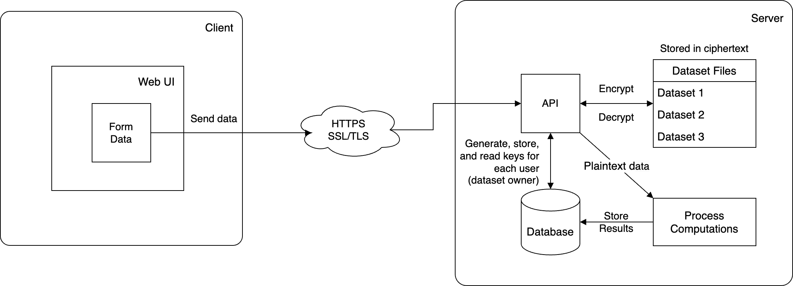
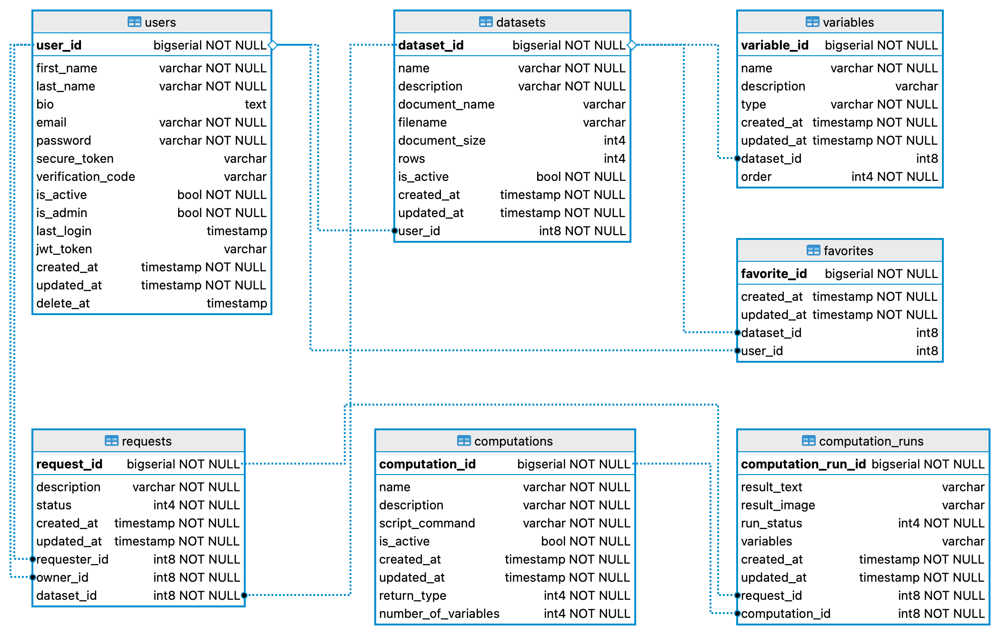

# ACSP4HR - SPDS



More screenshots: [Screenshot 2](images/spds_02.png), [Screenshot 3](images/spds_03.png), [Screenshot 4](images/spds_04.png)

This system (SPDS) is part of a research project called ACSP4HR - Assuring Cyber Security and Privacy for Human Resilience. It is sponsored by [UCCS](https://uccs.edu) and the [NSF](https://www.nsf.gov/) and it is part of my PhD research.

The system is currently accessible at: <https://acsp4hr.ml>

SPDS (Secure and Privacy-Preserving Data Sharing for Data Science Computations) is a secure and privacy-preserving data sharing system for data science computations toward the scientific community that actually `does not share the data`. The main goal is to provide a way to securely and privately share datasets that can still be used to run data science computations for research, but without the data itself never been disclosed, just the computations results.
In addition, the system provides secure authentication for users (for integrity) and a workflow for permission management to access datasets. This allows users to request access and dataset owners to grant or reject it, placing the control of the datasets in their hands.

The system usage is very straightforward to facilitate any person without much knowledge in data science to utilize it. Users are able to browse and search datasets using keywords that match the metadata associated to them (added by the owners). More information about a dataset can be viewed, but only the metadata, along with the variables (or features) that describe the data, but never the data itself. Then, if a dataset interests a user, they can request access to it. The owner of the dataset receives the request, analyzes it, and grant or reject it. If granted, the user that requested can now run computations on it from a list of available, pre-created, and pre-vetted computations on the system. The datasets are stored on the server always encrypted, never shared or transmitted via network, and only decrypted locally and temporarily for computations processing. More details about the whole system workflow, dataset encryption, and computations process will be explained later on the next sections.

A `paper` is being written to formalize all the scientific aspects of the project. It will be made available here once is done.
## Problem statement

The scientific research community often needs to share datasets to spread scientific data results that can help other groups in their own research. But often these datasets contain private information from subjects that may not have consented for their information to be publicly disclosed. Thus, many datasets end up not being shared at all, or they are data blinded to strip, sometimes, too much person-identifiable information, decreasing the quality of the data.

The main problem this work aim to solve is securing and preserving privacy of scientific data during its sharing process. That is a real problem that can even avoid some important research dataset to be shared. So this work brings a solution to this problem, by allowing data sharing without actually having to share the data, but only the permission to run computation on it and see the results. So the data is always preserved.

## Usage scanario


## System architecture



## Encryption model

This is the client-server encryption scheme that we use.



## Database design

The database used is Postgres DB.



## Structure of the project

- client
  - The frontend application in React.
- server
  - The server API in Nest JS.

## Server setup

Create a file `server/.env` based on `server/.env.example` with your server configuration for:

- Database secrets and server
  - DB_TYPE=postgres
  - DB_HOST=
  - DB_PORT=
  - DB_USERNAME=
  - DB_PASSWORD=
  - DB_NAME=
- JWT secret
  - JWT_SECRET=
- Sendgrid secrets (you can create a free SendGrid account)
  - VERIFIED_EMAIL_FROM=
  - SENDGRID_API_KEY=

## Deployment

To build the applications and deploy, run the following commands:

client

```sh
npm --prefix client install
npm --prefix client run build
```

server

```sh
npm --prefix server install
npm --prefix server run build
npm --prefix server run start:prod
```

## Team

University of Colorado - Colorado Springs (<https://uccs.edu>)

Computer Science Department (<https://eas.uccs.edu/cs>)

- Carlos Eugenio Torres (<carlos.torres@uccs.edu>) - Research Assistant - PhD student
- Dr. Shouhuai Xu (<sxu@uccs.edu>) - Project PI
- Dr. Yanyan Zhuang (<yzhuang@uccs.edu>) - Project Co PI
